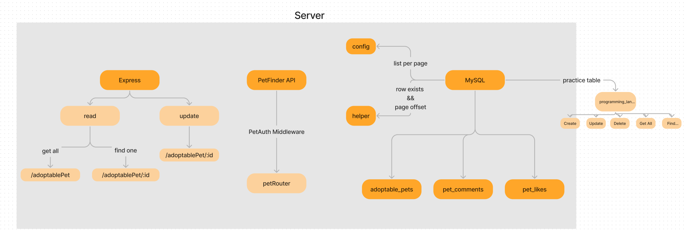
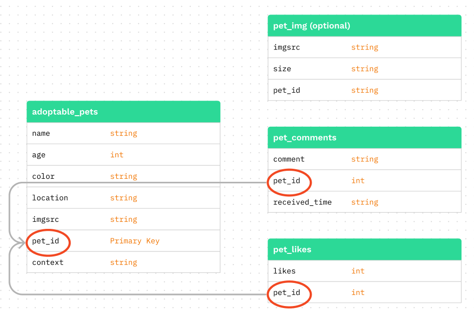

# BarkBook Back End

## Author: Elaine Huynh

### Deployed server
https://barkbook-prod-server.onrender.com

### Run Locally
    - npm i
    - node index.js

### Description

This is a simple RESTful API using express and NodeJS. It's main purpose is to utilize data from a Petfinder API and store the data within a MySQL database. It also provides authentication and authorization for users to be added within the database and to store their user info within the application.

This database will be updated bi-weekly by the owner ensure pets being requested are adoptable.

### Server Outline - data model

### Database Schema

### Endpoint
    - /getAnimals
        - Request data from Petfinder API and returns an array of pet data that can be added into pet database
    - CITE/adoptable-pets
        - Retrieves all available dog data within the database
            - includes image and Id
    - CITE/adoptable-pets/${id}
        - Retrieves data for one dog specifically
            - includes: name, image, age, location, Id, likes, comments
        - Updates specified pet within the database given body including all of current and new fields
        - Deletes specified pet (removal of animal occurs only on the backend to update all adotable pets vs adopted pets!)
    - CITE/login
        - Authenticates user account and returns a 200 code status or a 404 "Not a user" error
    - CITE/signup
        - Adds user information to the database and returns a 200 code status
